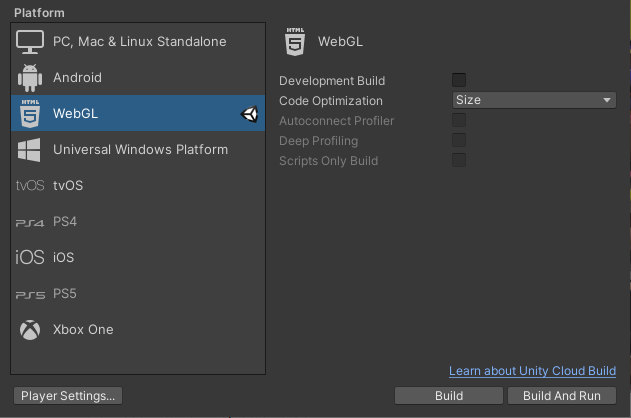
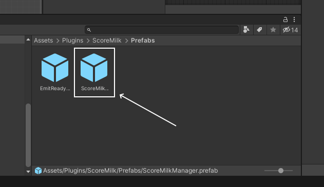

# Score Milk Unity SDK
Hello and Welcome to the ScoreMilk platform!
With this SDK you can integrate your Unity games to the Score Milk matchmaking system.

# Quick Start
 ### 1) Select "WebGL" as game Platform.
- Go to: File > Build Settings > Platform
- Select "WebGL"
Note: If you don’t find this option or it is disabled, please install WebGL build support package in Unity Hub.



 ### 2) Set WebGL Template to ScoreMilkTemplate
- Go to: Edit > Project Settings > Player > WebGL > Resolution and Presentation
- Select "ScoreMilkTemplate"


 ### 3) Check "Run in Background" option
- Go to: Edit > Project Settings > Player > WebGL > Resolution and Presentation, if you aren't already
- Check in "Run in Background"


 ### 4) Drag ScoreMilkManager Prefab to first scene
- Go to folder: Assets/Plugins/ScoreMilk/Prefabs
- Select and Drag "ScoreMilkManager" prefab to scene
- Prefab can be in every scene, it is an singleton that automatically removed copies



 ### 5) Subscribe GameObjects to ScoreMilk Events
- You Subscribe events in a GameObject as shown below:
```
private void OnEnable() {
    ScoreMilk.Connection.OnReceivedGetReady += OnMatchmaking;
}

private void OnDisable() {
    ScoreMilk.Connection.OnReceivedGetReady -= OnMatchmaking;
}
```
- You have to Subscribe/Unsubscribe to 4 events:
```
    ScoreMilk.Connection.OnReceivedGetReady // Player pressed "play" button. Game should go to real match scene and wait for start.
    ScoreMilk.Connection.OnReceivedStartPracticeGame // Player pressed "practice" button. Game should go to a practice scene. NOT title screen.
    ScoreMilk.Connection.OnReceivedQuitToMenu // Match was cancelled for any reason. Game should go back previous scene or title.
    ScoreMilk.Connection.OnReceivedStartRealGame // Both players are ready and accepted the required crypto transaction. Game should continue and start match.
    ScoreMilk.Connection.OnReceivedWalletConnected //  Wallet connected. Sends wallet address in event
    ScoreMilk.Connection.OnReceivedWalletDisconnected //  Wallet disconnected
```
Note: Unsubscribing is not strictly necessary, but it's considered good practice.

The information flow goes as follows:


 ### 6) Emit messages to server accordingly to game
- You emit messages like this:
ScoreMilk.Connection.EmitAddScore(points);

- You have to emit 3 messages:
```
    ScoreMilk.Connection.EmitReady(): When the game is ready to start a real match. After emitting this, just wait. Do not start the match yet.
    ScoreMilk.Connection.EmitAddScore(int points): When player scored `points`. `points` can be positive or negative.
    ScoreMilk.Connection.EmitGameOver(int points): When game has ended. `points` emitted at GameOver must be the same as the sum of all `points` emitted previously
```
Notes:

Location of code varies heavily accordingly with game

Points can be positive or negative. Negative points decrease final value.

Points emitted at GameOver must be the same as the sum of all points emitted previously.

 ### 7) You are done!

# Example

See "GameControllerExample.cs" script for a usage example and basic explanation

# Community and Support
You can meet other Score Milk users and get support on our [Discord](https://discord.gg/N2mEknPs)!